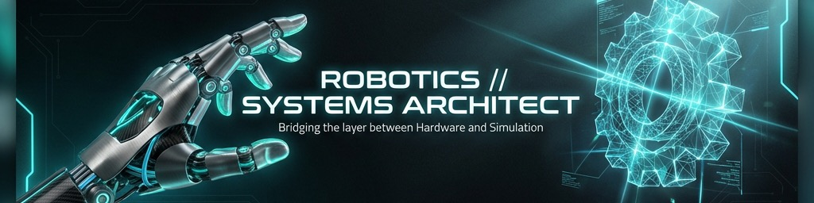

  
  
  # Arouna Patouossa Mounchili
  
  

---

### 🚀 About Me
I am a software developer specializing in **C++** and **Embedded Systems**, driven by the challenge of bridging low-level hardware control with high-level 3D simulation. 

- 🛠️ Currently refining **LinkForge**, a bridge between Blender and Robotics.
- 🤖 Expanding expertise into **ROS2**, **SLAM**, and **PCB Design**.
- 🧪 Passionate about automation and precision in robotics pipelines.

---

<h3 align="center">🛠️ Technical Arsenal</h3>

| | |
| :--- | :--- |
| **Languages** |      |
| **Embedded** |      |
| **Robotics** |     |
| **Tooling** |     |

---

<h3 align="center">🌟 Flagship Project: <a href="https://github.com/arounamounchili/linkforge">LinkForge</a></h3>

<b>Build Simulation-Ready Robots in Blender</b>

  
Professional URDF/XACRO exporter with validation, sensors, and ros2_control support. 
*Python, Blender API, ROS 2 Integration*
  

---

<h3 align="center">📫 Connect & Collaborate</h3>

  
  

 

  <i>"Exploring the layers between hardware and simulation."</i>

